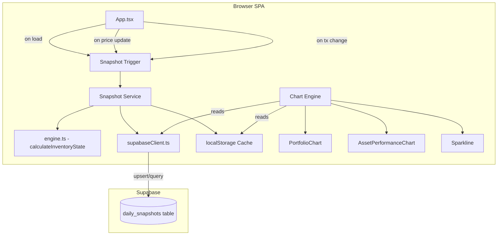

# Design Document: Daily Value Snapshots

## Overview

This feature replaces the transaction-replay approach for chart data with persistent daily value snapshots. Currently, `chartEngine.ts` computes time-series data by replaying the transaction ledger and applying the *current* market price to all historical points — producing charts that only have data on transaction dates and retroactively rewrite history with today's price.

Daily value snapshots solve this by recording each asset's market price, units held, and computed value at the end of each day. These records persist in a Supabase `daily_snapshots` table and serve as the primary data source for `PortfolioChart`, `AssetPerformanceChart`, and `Sparkline` components.

### Key Design Decisions

1. **Client-side snapshot engine** — All snapshot creation, backfill, and recalculation logic runs in the browser. There is no server-side cron job. Snapshots are created/updated on app open and after price changes. This keeps the architecture consistent with the existing SPA-only pattern (no Edge Functions needed for this feature).

2. **Carry-forward pricing for backfill** — When backfilling historical dates, the system uses the most recent known market price for each asset. This is the best available approximation since the app didn't previously record daily prices. Transaction prices serve as price anchors on transaction dates.

3. **Upsert semantics** — The unique constraint on `(asset_id, date)` enables upsert operations. Creating a snapshot for a date that already has one simply updates it. This simplifies both the "app open" and "price update" flows.

4. **Reuse existing calculation engine** — The `calculateInventoryState()` function from `engine.ts` is reused to derive units held and cost basis at any point in time. For backfill, transactions are filtered up to each target date and fed through the same engine.

5. **Snapshot service as a new module** — A new `services/snapshotService.ts` module encapsulates all snapshot CRUD, backfill, and cache logic. This follows the existing pattern where `services/storage.ts` handles asset/transaction CRUD and `services/priceFetcher.ts` handles price fetching.

6. **Chart engine additions, not replacements** — New functions are added to `chartEngine.ts` that convert snapshot data into the existing chart data types (`PortfolioTimeSeriesPoint[]`, `AssetTimeSeriesPoint[]`, `number[]`). The existing transaction-replay functions remain for backward compatibility but are no longer called from the UI.

## Architecture



### Data Flow: App Open

1. App loads assets + transactions from Supabase (existing flow)
2. Snapshot trigger checks localStorage cache for snapshots → renders charts immediately
3. Snapshot trigger loads snapshots from Supabase in background → updates cache
4. Snapshot trigger checks if today's snapshots exist for each held asset
5. For assets missing today's snapshot → create snapshot using current price + engine-derived units/cost
6. For assets with existing today's snapshot → update with latest price
7. If backfill is needed (large gap detected) → run backfill asynchronously

### Data Flow: Price Update

1. User updates price (manual or auto-fetch)
2. After price is saved to the asset → snapshot trigger creates/updates today's snapshot for that asset
3. Chart re-renders with updated snapshot data

### Data Flow: Transaction Change

1. User adds/edits/deletes a transaction
2. After transaction is saved → snapshot trigger recalculates snapshots for the affected asset from the transaction date onward
3. Only `units`, `costBasis`, and `marketValue` are recalculated; `marketPrice` is preserved

## Components and Interfaces

### 1. Snapshot Service (`services/snapshotService.ts`)

The core module for all snapshot operations.

```typescript
// Types
export interface DailySnapshot {
  id: string;
  assetId: string;
  date: string;        // ISO date string (YYYY-MM-DD)
  marketPrice: number;
  units: number;
  marketValue: number;  // units * marketPrice, rounded to 2dp
  costBasis: number;
}

// --- CRUD ---
/** Upsert a single snapshot (insert or update on conflict) */
export async function upsertSnapshot(snapshot: Omit<DailySnapshot, 'id'>): Promise<void>

/** Upsert multiple snapshots in a single batch */
export async function upsertSnapshotBatch(snapshots: Omit<DailySnapshot, 'id'>[]): Promise<void>

/** Load all snapshots for an asset within a date range */
export async function loadAssetSnapshots(
  assetId: string, startDate: string, endDate: string
): Promise<DailySnapshot[]>

/** Load aggregated portfolio snapshots (sum of marketValue per date) */
export async function loadPortfolioSnapshots(
  startDate: string, endDate: string
): Promise<{ date: string; value: number }[]>

/** Delete all snapshots for an asset */
export async function deleteAssetSnapshots(assetId: string): Promise<void>

// --- Snapshot Creation ---
/** Create or update today's snapshot for a single asset */
export async function createTodaySnapshot(
  asset: Asset, transactions: Transaction[]
): Promise<void>

/** Create or update today's snapshots for all held assets */
export async function createTodaySnapshotsForAll(
  assets: Asset[], transactions: Transaction[]
): Promise<void>

// --- Backfill ---
/** Check if backfill is needed and execute if so */
export async function backfillIfNeeded(
  assets: Asset[], transactions: Transaction[]
): Promise<void>

// --- Recalculation ---
/** Recalculate snapshots for an asset from a given date onward */
export async function recalculateSnapshots(
  asset: Asset, transactions: Transaction[], fromDate: string
): Promise<void>

// --- Cache ---
/** Read snapshots from localStorage cache */
export function readSnapshotCache(): DailySnapshot[] | null

/** Write snapshots to localStorage cache */
export function writeSnapshotCache(snapshots: DailySnapshot[]): void

/** Clear snapshot cache for a specific asset */
export function clearAssetSnapshotCache(assetId: string): void
```

### 2. Chart Engine Additions (`chartEngine.ts`)

New pure functions that convert snapshot data into chart-ready formats:

```typescript
/** Convert portfolio-level snapshots to PortfolioTimeSeriesPoint[] */
export function snapshotsToPortfolioTimeSeries(
  snapshots: { date: string; value: number }[]
): PortfolioTimeSeriesPoint[]

/** Convert asset-level snapshots to AssetTimeSeriesPoint[] */
export function snapshotsToAssetTimeSeries(
  snapshots: DailySnapshot[]
): AssetTimeSeriesPoint[]

/** Extract recent market values from snapshots for sparkline rendering */
export function snapshotsToSparklineData(
  snapshots: DailySnapshot[], pointCount?: number
): number[]
```

### 3. Snapshot Trigger Integration (`App.tsx`)

New state and effects added to `App.tsx`:

```typescript
// New state
const [snapshots, setSnapshots] = useState<DailySnapshot[]>([]);
const [isBackfilling, setIsBackfilling] = useState(false);
const hasRunSnapshotInit = useRef(false);

// New effect: after data loads, trigger snapshot creation + backfill
useEffect(() => {
  if (hasRunSnapshotInit.current || assets.length === 0) return;
  hasRunSnapshotInit.current = true;
  // 1. Load cached snapshots immediately
  // 2. Create today's snapshots
  // 3. Backfill if needed
  // 4. Refresh from Supabase
}, [assets, transactions]);

// Modified: after price update, also upsert today's snapshot
// Modified: after transaction CRUD, recalculate affected snapshots
```

### 4. UI Component Changes

**PortfolioChart** — No interface changes. Receives `PortfolioTimeSeriesPoint[]` as before, but the data now comes from snapshots instead of `computePortfolioTimeSeries()`.

**AssetPerformanceChart** — No interface changes. Receives `AssetTimeSeriesPoint[]` as before, but sourced from snapshots.

**Sparkline** — No interface changes. Receives `number[]` as before, but sourced from snapshots.

The chart components themselves don't change — only the data pipeline feeding them changes.

## Data Models

### DailySnapshot

| Field       | Type   | Description                                          |
|-------------|--------|------------------------------------------------------|
| id          | string | UUID primary key                                     |
| assetId     | string | Foreign key to assets table                          |
| date        | string | ISO date (YYYY-MM-DD), date-only, no time component |
| marketPrice | number | Market price of the asset on this date               |
| units       | number | Units held at end of this date                       |
| marketValue | number | `units * marketPrice`, rounded to 2dp                |
| costBasis   | number | Book value derived from inventory state              |

### Supabase Table: `daily_snapshots`

| Column       | Type    | Constraints                              |
|--------------|---------|------------------------------------------|
| id           | uuid    | PRIMARY KEY, default `gen_random_uuid()`  |
| asset_id     | text    | NOT NULL, REFERENCES assets(id)          |
| date         | date    | NOT NULL                                 |
| market_price | numeric | NOT NULL                                 |
| units        | numeric | NOT NULL                                 |
| market_value | numeric | NOT NULL                                 |
| cost_basis   | numeric | NOT NULL                                 |

**Indexes**:
- `UNIQUE (asset_id, date)` — enforces one snapshot per asset per day
- `INDEX ON (asset_id)` — efficient per-asset queries
- `INDEX ON (date)` — efficient date-range queries

### SQL Migration

```sql
CREATE TABLE daily_snapshots (
  id uuid PRIMARY KEY DEFAULT gen_random_uuid(),
  asset_id text NOT NULL REFERENCES assets(id) ON DELETE CASCADE,
  date date NOT NULL,
  market_price numeric NOT NULL,
  units numeric NOT NULL,
  market_value numeric NOT NULL,
  cost_basis numeric NOT NULL,
  UNIQUE (asset_id, date)
);

CREATE INDEX idx_daily_snapshots_asset_id ON daily_snapshots(asset_id);
CREATE INDEX idx_daily_snapshots_date ON daily_snapshots(date);
```

### DB ↔ TypeScript Mapping

| DB Column      | TypeScript Field |
|----------------|------------------|
| id             | id               |
| asset_id       | assetId          |
| date           | date             |
| market_price   | marketPrice      |
| units          | units            |
| market_value   | marketValue      |
| cost_basis     | costBasis        |

### localStorage Cache Keys

| Key                      | Content                        |
|--------------------------|--------------------------------|
| `it_cache_snapshots`     | JSON array of `DailySnapshot[]` |
| `it_cache_snapshots_ts`  | Timestamp of last cache write  |


## Correctness Properties

*A property is a characteristic or behavior that should hold true across all valid executions of a system — essentially, a formal statement about what the system should do. Properties serve as the bridge between human-readable specifications and machine-verifiable correctness guarantees.*

### Property 1: Market value invariant

*For any* snapshot with `units` ≥ 0 and `marketPrice` ≥ 0, the `marketValue` field SHALL equal `round(units * marketPrice, 2)`. This invariant holds regardless of whether the snapshot was created during app open, price update, backfill, or recalculation.

**Validates: Requirements 1.3**

### Property 2: Snapshot units and cost basis match engine output

*For any* asset, *for any* set of transactions, and *for any* target date, a snapshot's `units` and `costBasis` fields SHALL match the values computed by `calculateInventoryState()` when given only the transactions dated on or before the target date. During recalculation after transaction changes, the `marketPrice` field SHALL be preserved (unchanged from its original value).

**Validates: Requirements 1.4, 4.3, 10.1, 10.2**

### Property 3: Only held assets receive snapshots

*For any* set of assets, the snapshot trigger SHALL create today's snapshot only for assets where the engine-derived units held is greater than zero. Assets with zero units held SHALL NOT receive a snapshot.

**Validates: Requirements 2.1**

### Property 4: Backfill date range completeness

*For any* earliest transaction date `D` where `D` is before yesterday, the backfill date enumeration SHALL produce exactly one date for each calendar day from `D` to yesterday (inclusive), with no gaps and no duplicates.

**Validates: Requirements 4.2**

### Property 5: Carry-forward pricing correctness

*For any* asset and *for any* chronologically ordered sequence of dates with sparse known prices (from transactions), the carry-forward algorithm SHALL assign to each date the most recent known price on or before that date. If no known price exists on or before a date, that date SHALL be skipped (no snapshot created).

**Validates: Requirements 4.4, 4.5**

### Property 6: Portfolio aggregation correctness

*For any* set of daily snapshots across multiple assets, the aggregated portfolio value for each date SHALL equal the sum of `marketValue` across all assets that have a snapshot on that date. The aggregation SHALL not double-count or omit any snapshot.

**Validates: Requirements 5.2**

### Property 7: Portfolio snapshot to time series mapping

*For any* array of portfolio-level snapshots `{ date, value }`, the function `snapshotsToPortfolioTimeSeries` SHALL return a `PortfolioTimeSeriesPoint[]` where each element's `date` and `value` match the corresponding input element, preserving order.

**Validates: Requirements 6.1**

### Property 8: Asset snapshot to time series mapping

*For any* array of `DailySnapshot` objects, the function `snapshotsToAssetTimeSeries` SHALL return an `AssetTimeSeriesPoint[]` where each element's `date` equals the input's `date`, `marketValue` equals the input's `marketValue`, and `costBasis` equals the input's `costBasis`, preserving order.

**Validates: Requirements 7.1**

### Property 9: Sparkline data extraction

*For any* array of `DailySnapshot` objects sorted by date and *for any* `pointCount` N ≥ 1, the function `snapshotsToSparklineData` SHALL return a `number[]` containing the `marketValue` of the last `min(N, snapshots.length)` snapshots, in chronological order.

**Validates: Requirements 8.1**

## Error Handling

### Snapshot Creation Errors

| Scenario | Handling |
|----------|----------|
| Supabase upsert fails for one asset | Log error, continue processing remaining assets (Req 2.4) |
| Supabase upsert fails for all assets | Log error, app continues with stale/no snapshot data |
| Network unavailable during snapshot creation | Silently fail, charts use cached data |

### Backfill Errors

| Scenario | Handling |
|----------|----------|
| Batch upsert fails mid-backfill | Log error, stop backfill for this session; partial data is usable |
| No transactions exist (empty ledger) | Skip backfill entirely — no dates to enumerate |
| Backfill takes too long | No timeout; runs asynchronously without blocking UI |

### Recalculation Errors

| Scenario | Handling |
|----------|----------|
| Recalculation fails after transaction change | Log error (Req 10.4); snapshots may be stale until next app open |
| Supabase batch update fails | Log error, continue; next app open will re-trigger |

### Cache Errors

| Scenario | Handling |
|----------|----------|
| localStorage full | Catch silently, app works without cache (slower chart load) |
| Cache data corrupted | Catch parse error, clear cache, reload from Supabase |
| Supabase fetch fails on refresh | Continue serving cached data (Req 5.5) |

### Asset Deletion Errors

| Scenario | Handling |
|----------|----------|
| Snapshot deletion fails after asset delete | Log error, don't block asset deletion (Req 9.3); orphaned rows cleaned by ON DELETE CASCADE |

## Testing Strategy

### Property-Based Tests

Property-based tests validate the core snapshot logic using `fast-check`. Each test runs a minimum of 100 iterations.

| Property | What it tests | Generator strategy |
|----------|--------------|-------------------|
| Property 1: Market value invariant | `marketValue === round(units * marketPrice, 2)` | Random positive floats for units (0-100000) and marketPrice (0-1000000) |
| Property 2: Snapshot matches engine | Snapshot units/costBasis match engine output for filtered transactions | Random transaction arrays (1-20 txs) with random dates, quantities, prices; random target dates |
| Property 3: Only held assets | Snapshot trigger filters to assets with units > 0 | Random asset arrays where some have transactions and some don't |
| Property 4: Date range completeness | Backfill enumerates all calendar days in range | Random start dates (1-365 days ago), verify contiguous day sequence |
| Property 5: Carry-forward pricing | Correct most-recent-price lookup | Random sparse price maps (dates → prices), random query dates |
| Property 6: Portfolio aggregation | Sum of asset values per date | Random multi-asset snapshot sets (2-10 assets, 5-30 days) |
| Property 7: Portfolio time series mapping | Date/value preservation | Random arrays of {date, value} objects |
| Property 8: Asset time series mapping | Field mapping preservation | Random DailySnapshot arrays |
| Property 9: Sparkline extraction | Last N marketValues extracted | Random DailySnapshot arrays (1-50 items), random pointCount (1-20) |

### Unit Tests (Example-Based)

Unit tests cover specific scenarios, integration points, and error conditions:

- **Snapshot creation on app open**: verify `createTodaySnapshotsForAll` is called after data loads
- **Snapshot update on price change**: verify `createTodaySnapshot` is called after manual price edit and after auto-fetch
- **Snapshot recalculation on transaction CRUD**: verify `recalculateSnapshots` is called with correct `fromDate`
- **Backfill trigger condition**: verify backfill runs only when gap > 1 day and only once per session
- **Backfill batching**: verify large backfills are split into batches (e.g., 500 rows per batch)
- **Asset deletion cleanup**: verify `deleteAssetSnapshots` and `clearAssetSnapshotCache` are called
- **Cache read/write**: verify localStorage round-trip for snapshot data
- **Error resilience**: verify one asset's failure doesn't block others
- **Chart data wiring**: verify PortfolioChart, AssetPerformanceChart, and Sparkline receive snapshot-derived data

### Integration Tests

- **SQL migration**: verify the migration script creates the table with correct columns, constraints, and indexes
- **Supabase upsert**: verify upsert correctly inserts new rows and updates existing ones on `(asset_id, date)` conflict
- **End-to-end chart flow**: load snapshots from Supabase → convert via chart engine → verify chart receives correct data format
